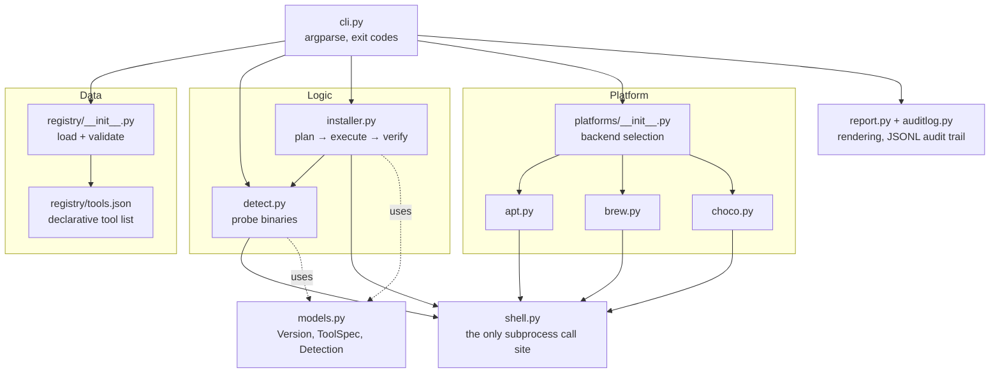

# eSim Automated Tool Manager — Design Document

**FOSSEE Semester-Long Internship, Autumn 2026 — eSim Screening Task 5**

---

## 1. Problem and scope

eSim integrates several external programs (Ngspice, KiCad, GHDL, Verilator and
others) which it drives as subprocesses instead of linking as libraries.
Keeping those programs installed, at compatible versions, on three operating
systems is currently a manual chore, and it is the most common reason a new
eSim installation does not work.

This project is an **Automated Tool Manager**: a command-line program that
reports what eSim needs, what the machine actually has, and installs the
difference.

The task asks for any two of its six requirement groups. This submission
implements three:

| # | Requirement | Status | Where |
|---|---|---|---|
| 1 | **Tool Installation Management** | Implemented | `installer.py`, `platforms/` |
| 2 | Update and Upgrade System | Partial: outdated tools are detected and re-installed through the same path, but there is no separate upgrade channel | `detect.py`, `installer.py` |
| 3 | Configuration Handling | Not implemented | — |
| 4 | **Dependency Checker** | Implemented | `detect.py`, `registry/` |
| 5 | **User Interface** (CLI, inventory, logs) | Implemented | `cli.py`, `report.py`, `auditlog.py` |
| 6 | *Optional:* cross-platform + package managers | Implemented (apt / Homebrew / Chocolatey) | `platforms/` |

Requirement 2 is listed as partial because that is what it is. The manager
compares installed versions against requirements and can re-install to satisfy
them, but it does not implement scheduled update checks or an upgrade-only path
that leaves configuration untouched. Section 9 says what finishing it would
involve.

---

## 2. Design principles

Four decisions shape everything else. Each was a real trade-off, so each is
stated with its cost.

### 2.1 Standard library only

A tool manager is what runs *before* a machine is provisioned. If it needed
`requests`, `pyyaml` or `click` to start, the user would have to solve a
dependency problem in order to run the program that solves dependency
problems. Every module therefore imports only from the Python standard
library, and the registry is JSON instead of YAML for the same reason.

*Cost:* the table and colour rendering in `report.py` is hand-written, roughly
120 lines that a library would have provided.

### 2.2 Data and code are separate

*What* eSim needs lives in `registry/tools.json`. *How* to install things lives
in `platforms/`. Adding a tool, correcting a package name or retargeting the
manager at a new eSim release is a data edit that requires no Python change and
no new tests.

*Cost:* a malformed registry becomes a runtime error instead of a syntax error,
so `Registry.load` validates aggressively and `tests/test_registry_and_cli.py`
contains integrity tests over the shipped data.

### 2.3 Probe the tool, not the package database

To decide whether Ngspice is installed, the manager runs `ngspice --version`
and reads the answer. It consults `apt`/`brew` only as a fallback.

This is the single most important decision in the project, and it is specific
to eSim's user base. eSim's own workflow leads users to **build Ngspice and
GHDL from source**, since NGHDL compiles model code against a source Ngspice
tree. On such a machine `dpkg` reports Ngspice as absent. A manager that
trusted the package database would declare a working installation broken and
install a second, conflicting copy over it. Asking the tool itself cannot make
that mistake.

*Cost:* probing spawns a subprocess per tool (about 7 processes for a full
check, under a second in practice) and needs a version-parsing pattern per
tool, because every program prints its banner differently.

### 2.4 Plan and execute are separate phases

Backends never install anything. They return the command they *would* run;
the installer decides whether to execute it.

This makes `--dry-run` exact instead of approximate. The commands printed in a
dry run are the same tuples that execution passes to `subprocess`, produced by
the same code path, so a dry run cannot drift out of step with real behaviour.

*Cost:* one extra indirection between backend and installer.

---

## 3. Architecture



### 3.1 Module responsibilities

| Module | Responsibility | Deliberately does *not* |
|---|---|---|
| `models.py` | Version arithmetic, constraints, tool specs, result types | Touch the filesystem or run commands |
| `shell.py` | Every subprocess invocation, plus dry-run and test doubles | Know anything about tools or packages |
| `registry/` | Load and validate `tools.json` | Know about platforms |
| `platforms/` | Per-package-manager naming, query and command construction | Execute installs |
| `detect.py` | Decide each tool's status on this machine | Change anything |
| `installer.py` | Turn detections into a plan; execute and verify it | Format output |
| `report.py` | Human-readable rendering | Make decisions |
| `auditlog.py` | Human log + append-only JSONL audit trail | Fail the run if logging fails |
| `cli.py` | Argument parsing, command dispatch, exit codes | Contain business logic |

The dependency graph is acyclic and one-directional: `cli → {installer,
detect} → {platforms, shell} → models`. No lower layer imports a higher one,
which is what allows every layer to be tested in isolation.

### 3.2 Why `shell.py` is a single choke point

Routing every external command through one small interface buys three things
that would otherwise each need separate machinery:

* **Dry-run** is a `Runner` subclass, not an `if dry_run:` branch repeated at
  every call site.
* **Auditability.** The audit log records commands here, so no command can run
  without being logged.
* **Testability.** `FakeRunner` returns canned output keyed by command, so the
  entire suite runs on a machine with none of eSim's tools installed.

`Runner.run` and `Runner.run_mutating` are distinguished so a dry run can
suppress exactly the state-changing commands while still probing versions for
real, which is what makes a dry run genuinely informative.

---

## 4. Data model

### 4.1 The registry entry

```jsonc
"ngspice": {
  "summary": "Mixed-level/mixed-signal circuit simulator; eSim's simulation engine.",
  "criticality": "required",           // required | recommended | optional
  "used_by": ["Simulation", "NGHDL", "NgVeri"],
  "probe": {                            // how to ask the tool its version
    "executable": "ngspice",
    "args": ["--version"],
    "pattern": "ngspice-([0-9]+(?:\\.[0-9]+)*)",
    "merge_stderr": true                // many tools print the banner to stderr
  },
  "version": { "min": "34", "source": "assumed" },
  "packages": {
    "apt":  "ngspice",
    "brew": "ngspice",
    "choco": { "package": "",
               "note": "No maintained Chocolatey package; the eSim Windows installer bundles Ngspice." }
  }
}
```

Three details in that shape are worth drawing out.

**`criticality`** drives the exit code. A missing *required* tool means eSim
cannot run and exits 1; a missing *optional* tool exits 2. That distinction is
what makes the command usable in a provisioning script.

**`version.source`** records provenance. eSim does not publish a
machine-readable matrix of supported tool versions, so some bounds here are
conservative floors chosen by this project, not documented requirements.
Marking them `assumed` versus `esim-docs` keeps an inference from being read as
authority, and the CLI prints the provenance whenever it reports a version
conflict, so a user can judge whether to believe it. An integrity test asserts
every constraint carries one of the two values.

**An empty package name with a `note`** models "this tool exists but cannot be
installed this way" as data. That is how the Windows backend explains that
Ngspice ships inside eSim's own installer instead of silently reporting it as
uninstallable.

### 4.2 Version comparison

Tool version strings are not standardised: `ngspice-42`, `9.0.1`,
`Verilator 5.020 2024-01-01`, `XTerm(389)`. `Version.parse` extracts the first
dotted-numeric run and compares component-wise, zero-padding to equal length so
`42` equals `42.0.0`. Comparison is numeric, not lexical, because `10.0 > 9.0`
is something string comparison gets wrong. Debian epochs (`1:8.0.4`) are
stripped in the apt backend, since the epoch is packaging metadata and not part
of the upstream version.

---

## 5. Control flow

### 5.1 `toolman check` — the dependency checker

```
load registry → select backend → for each tool:
    which(executable)?
        no  → MISSING          (with the reason and the package that provides it)
        yes → run probe command
                version parsed?   no → ask the package database
                                       still nothing → UNKNOWN_VERSION
                constraint satisfied?  yes → OK
                                        no → OUTDATED
→ render table → exit 0 / 1 / 2
```

`UNKNOWN_VERSION` is a distinct state instead of collapsing into `MISSING`,
because the two demand opposite responses. A missing tool should be installed;
a tool that is present but unreadable is probably working and must not be
overwritten. The installer refuses to touch it without an explicit
`--reinstall`.

### 5.2 `toolman install` — installation management

```
detect → plan → display → confirm → execute → verify → audit
```

Planning is a pure function of the detections. It emits an action per tool that
needs work and a *reason* per tool that was skipped. Skips are surfaced instead
of dropped, because "why did it not install Ngspice on Windows?" is exactly the
question a user has.

**Verification** re-probes each tool after its install command succeeds. A
package manager exiting zero means "the package was unpacked", not "the tool
now runs", and the gap is real: a Homebrew cask can install KiCad while
`kicad-cli` stays off `PATH`. In that case the manager reports failure with the
PATH explanation instead of a false success.

### 5.3 Exit codes

| Code | Meaning |
|---|---|
| 0 | Everything required is satisfied |
| 1 | A required tool is missing or unusable, so eSim will not run |
| 2 | Only recommended/optional shortfalls, or the user aborted |
| 3 | Usage or configuration error (unknown tool, unknown backend, bad registry) |

---

## 6. Cross-platform strategy

Supporting a package manager means implementing one class (`is_available`,
`install_command`, `query_installed`, `query_candidate`) and registering it.
Nothing in the installer, checker or CLI changes.

| Backend | Platform | Privilege | Notes |
|---|---|---|---|
| `apt` | Linux (Debian/Ubuntu) | `sudo` | eSim's primary platform; `apt-cache policy` gives installed *and* candidate versions |
| `brew` | macOS | none | Homebrew rejects `sudo`; casks (KiCad, XQuartz) need `--cask` |
| `choco` | Windows | Administrator | Several tools have no package; the registry records why |

`--backend` forces a backend regardless of the host, which allows the Windows
and Linux plans to be inspected from a Mac. Availability is still reported
truthfully in that mode ("forced, but it is not installed here"), so a forced
plan is never mistaken for a real one.

**On macOS support.** eSim itself is not packaged for macOS. The Homebrew
backend exists because every *tool eSim drives* is available there, which makes
macOS a viable development host, and because the task lists cross-platform
support among its optional features. It does not imply that eSim runs on macOS.

---

## 7. Failure handling

The design assumes external commands fail routinely, and converts failures into
advice instead of stack traces:

| Situation | Behaviour |
|---|---|
| Package manager absent | Reported by name; no traceback |
| Tool present, version unparseable | `UNKNOWN_VERSION`; installer refuses to overwrite it |
| Install exits non-zero | Exit code mapped to a cause: privileges, bad package name, apt lock held, timeout |
| Install succeeds, tool still absent | Verification catches it and reports a probable `PATH` problem |
| Probe hangs | 20-second timeout; installs get 30 minutes |
| Log directory unwritable | Logging silently disables itself; the run continues |
| Broken package database | Query returns `None`; the probe result still stands |

The last two encode the same rule: **the manager's own auxiliary features must
never be the reason a run fails.**

---

## 8. Testing strategy

93 tests, standard-library `unittest`, no fixtures on disk and no tools
installed. They run in about 0.05 s.

```
python3 -m unittest discover -s tests
```

| File | Covers |
|---|---|
| `test_models.py` | Version parsing, numeric ordering, constraint windows, provenance defaults |
| `test_detect.py` | Each detection state; stderr banners; non-zero-exit banners; package-DB fallback; the source-build scenario |
| `test_backends.py` | Command construction per backend, cask handling, apt policy parsing, Debian epochs, malformed JSON, backend selection |
| `test_installer.py` | Plan decisions, skip reasons, dry-run isolation, post-install verification, failure-message mapping |
| `test_registry_and_cli.py` | Registry validation, **shipped-data integrity**, CLI exit codes, `--dry-run` issues no install commands |

Two groups are worth singling out.

*Integrity tests over the shipped registry* assert that every tool has a probe,
that every uninstallable package carries an explanatory note, that every
version constraint declares provenance, and that every probe pattern compiles.
These catch data typos that no logic test would, which is the failure mode a
data-driven design otherwise invites.

*The dry-run isolation test* asserts that no command containing `install`
reaches the runner during `--dry-run`. It tests the safety property directly
instead of trusting the flag.

### 8.1 What stubbed tests could not catch

The suite above passed completely while two real defects were present. Both
were found by running the manager for real inside an Ubuntu 24.04 container
(`scripts/verify-linux.sh`), and both are worth recording because they mark the
boundary of what mocking can prove.

**1. `sudo` was prepended unconditionally.** The apt backend built
`sudo apt-get install -y ngspice`. That is correct for a desktop user and is
what the tests asserted, but Docker images, CI runners and many cloud VMs run
as root *and ship no `sudo` binary at all*. The install failed with
`sudo: not found` while apt sat working two directories away. Worse, the error
handler blamed the wrong program: it mapped exit 127 to "apt is not installed".

The fix separates "this backend needs elevation" (`Backend.elevates`) from
"this process already has it" (`Backend.is_elevated`), and
`privilege_prefix()` returns an empty tuple when already root. The elevation
state is injectable, so both situations are now tested without the suite
depending on who runs it. That was itself a latent problem, since the original
tests would have started failing the moment anyone ran them as root. The 127
handler now names the executable that was actually missing.

**2. The CLI tests wrote to the user's real audit log.** `cmd_install`
constructs `AuditLog(args.log_dir)`, and the tests passed no `--log-dir`, so
every test run appended dry-run records to
`~/Library/Logs/esim-toolmanager/actions.jsonl` on the developer's machine.
The tests still passed, because they were asserting on exit codes and not on
side effects. It surfaced only because the audit log printed at the end of the
container run contained a `python3` entry that no part of that run had
produced. Tests now confine logging to a temporary directory, and a regression
test asserts that they do.

Both cases point at the same limit. Stubbing verifies the logic you thought to
write, and these tests do that well. It cannot verify assumptions about the
environment: who you are, what exists on `PATH`, what a command writes outside
its return value. Those need a real machine, which is why the containerised
end-to-end run is part of the project and not an afterthought.

---

## 9. Limitations

* **Requirement 2 is partial.** Outdated tools are detected and can be
  re-installed, but there is no scheduled update check and no upgrade-only path.
  Completing it means adding `query_candidate` comparison to a dedicated
  `upgrade` command; the backend method already exists and is tested.
* **Version floors are mostly assumed.** They are marked as such in the data
  and in every message that cites them. Establishing real floors requires
  testing eSim against each tool version, which needs a working eSim install.
* **The apt backend is validated against Debian-family containers**, not
  against every Ubuntu release eSim targets.
* **`gaw` and the SKY130 PDK are not in the registry.** Neither is available
  through a system package manager; both need a source build or a bespoke
  fetcher, which the current backend interface does not model. A future
  `SourceBackend` would fit the same interface.
* **No rollback.** If an install half-completes, the manager reports it but
  cannot undo it.
* **Chocolatey coverage is thin**, because most of these tools genuinely are
  not packaged for it. On Windows the eSim installer remains the right answer,
  and the registry says so.

---

## 10. Requirement traceability

| Task requirement | Implementation | Test |
|---|---|---|
| Download and install external tools automatically | `installer.execute_plan` + backends | `test_installer.py::TestExecutePlan` |
| Ensure compatibility with the system environment | `platforms.select_backend` | `test_backends.py::TestBackendSelection` |
| Handle version control / correct versions | `models.VersionConstraint`, `detect.detect_tool` | `test_models.py`, `test_detect.py` |
| Check and manage dependencies | `detect.detect_all` | `test_detect.py::TestDetectTool` |
| Feedback when dependencies are missing or incompatible | `detect._missing_detail`, `report.render_detections` | `test_detect.py` |
| Simple CLI | `cli.py` | `test_registry_and_cli.py::TestCli` |
| View installed tools, versions, available updates | `toolman check`, `list`, `show` | `test_registry_and_cli.py` |
| Log of actions taken | `auditlog.AuditLog` (JSONL) + `toolman log` | — |
| *Optional:* cross-platform support | apt / brew / choco backends | `test_backends.py` |
| *Optional:* package-manager integration | `platforms/` | `test_backends.py` |

---

## 11. Extending the manager

**Add a tool.** Append an entry to `registry/tools.json`. No code change; the
integrity tests will tell you if the entry is incomplete.

**Add a package manager.** Subclass `Backend`, implement four methods, add it
to `ALL_BACKENDS`. `dnf` or `pacman` would be roughly forty lines each.

**Add a command.** Write a `cmd_*` function in `cli.py` and register it in
`COMMANDS`.
